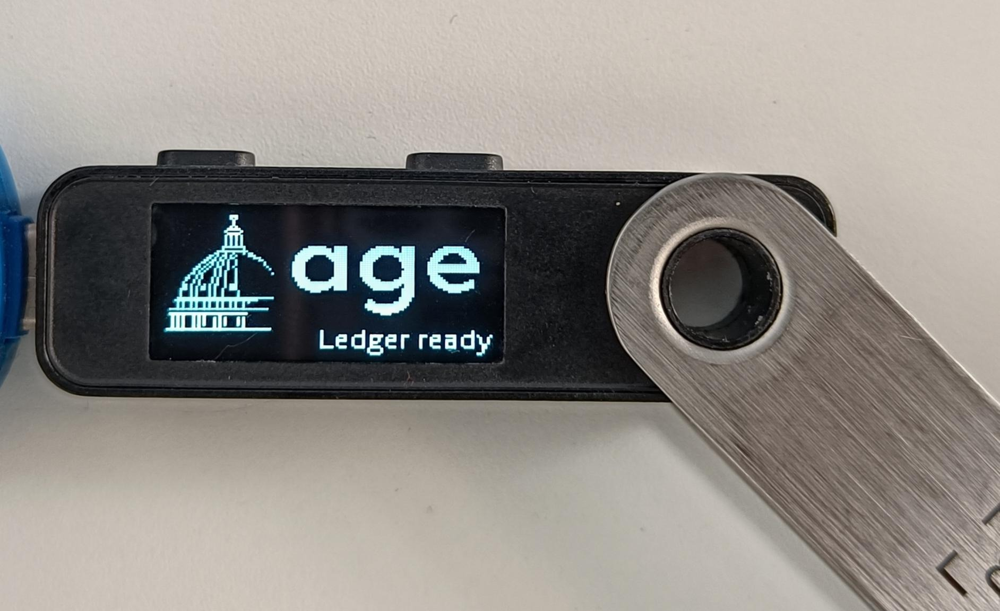
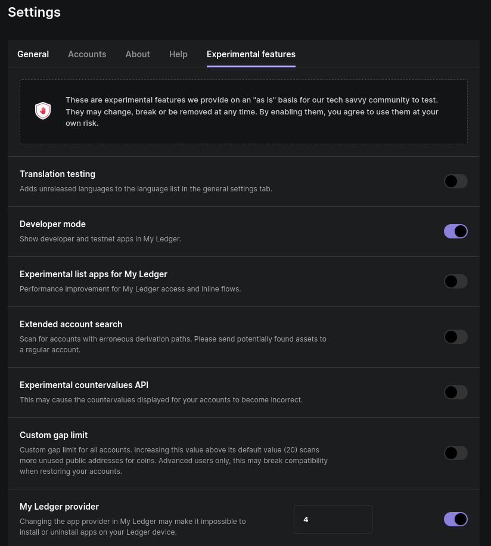
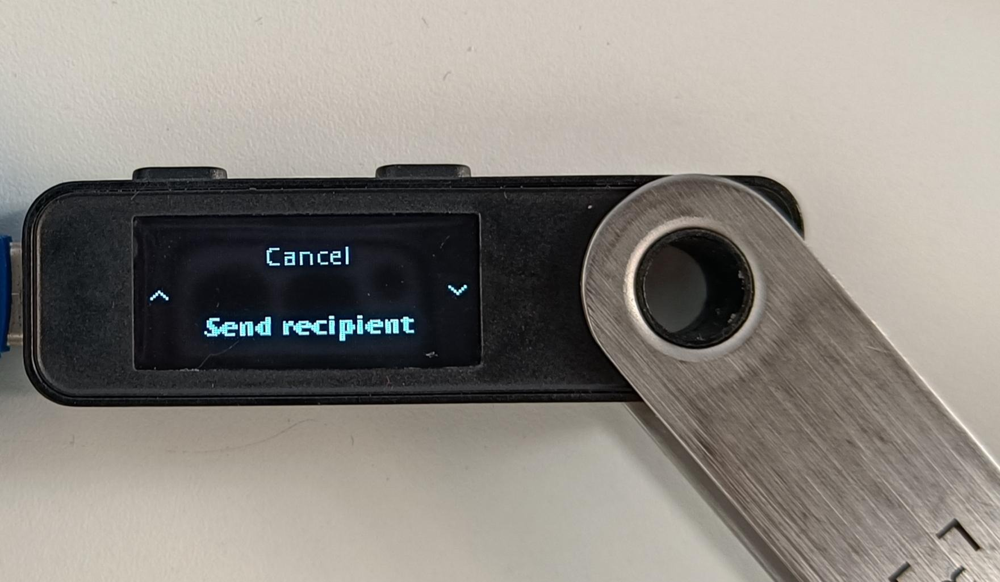
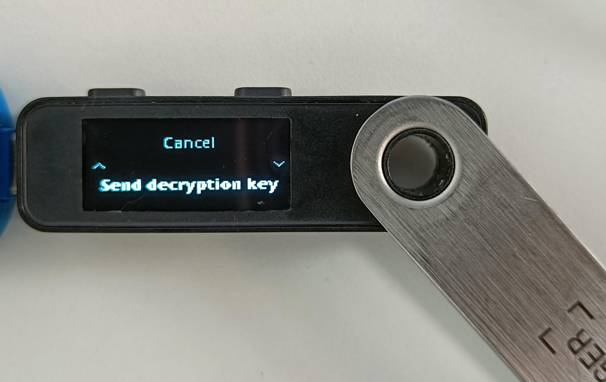

# Ledger application for age encryption/decryption

Encrypt/decrypt files by using [age](https://age-encryption.org/v1) and a public/private key stored on a Ledger device.

This app is used to manage age identity on a Ledger device.



## Installing the app

### Ledger Live App catalog (Nano S Plus only)

A version of this app for __Nano S Plus__ is available on __Ledger Live__. To install it:

* Open [Ledger Live](https://www.ledger.com/ledger-live)
* Since the app is still in pre-release, you need to enable Developer mode and manually choose the right app provider.
  * Go to `Settings`
  * Enable `Developer mode`
  * Under `My Ledger provider`, choose 4

  
* With your device plugged in: go to `My Ledger`, search in the app catalog for `age identity` and install it.

### Local building and installing

You can also compile this app locally and load it to your device by using [Cargo Ledger](https://github.com/LedgerHQ/cargo-ledger).

To do so, just execute: `cargo ledger build nanos --load`.

## Requirements

To use this app, you need first to:
* Install an age client (eg. [winage](https://github.com/spieglt/winage), [age](https://github.com/FiloSottile/age) or [rage](https://github.com/str4d/rage));
* Install the [Ledger plugin for age](https://github.com/Ledger-Donjon/age-plugin-ledger).

## Usage

There are four basic usage (illustrated here by using `rage` client and a Nano S Plus).

### Encryption

#### Retrieving the recipient associated with the age identity

A recipient string containing public data needs to be provided in order to perform encryption.

To retrieve the recipient associated to a Ledger device, call the ledger plugin with the `--list` option.

```
➜ age-plugin-ledger --list
age1ledger1qtrtrlkyewan5wcl75zetx6wy9j8vrw4kvy388ew0estmcgcj6wsw9sle8v
```



#### Encrypting for a Ledger recipient

To encrypt, just use your age client as you would for any other type of recipient.

```
➜ rage -r age1ledger1qtrtrlkyewan5wcl75zetx6wy9j8vrw4kvy388ew0estmcgcj6wsw9sle8v -e example -o example.age
```

__Note__ that this step can be done without having any Ledger device, but still requires the [Ledger plugin for age](https://github.com/Ledger-Donjon/age-plugin-ledger).

### Decryption

#### Retrieving the identity stub

In order to decrypt a file, age clients require to provide an identity (that usually contains the private data associated with a recipient).
The Ledger plugin for age uses a "stub" identity which does not contain any private data. It is used to identify the device holding the
private material needed to decrypt for a given recipient.

To retrieve a stub identity associated with a Ledger device, call the ledger plugin with the `--identity` option.

```
➜ age-plugin-ledger --identity | tee id
Recipient: age1ledger1qtrtrlkyewan5wcl75zetx6wy9j8vrw4kvy388ew0estmcgcj6wsw9sle8v
#    Recipient: age1ledger1qtrtrlkyewan5wcl75zetx6wy9j8vrw4kvy388ew0estmcgcj6wsw9sle8v
AGE-PLUGIN-LEDGER-1WH90T6PD06QN907ADRARJTDMR20K7K8HQQVY8RX7PSVGS5P3Q7PQLHDJXV 
```

#### Decrypting with a Ledger stub identity

To decrypt, just use your age client as you would for any other type of identity.

```
➜ rage -d -i id -o example_decrypted example.age
```

